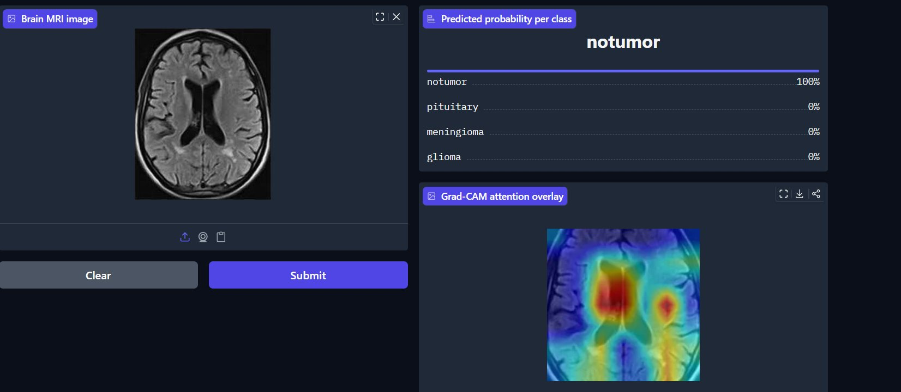
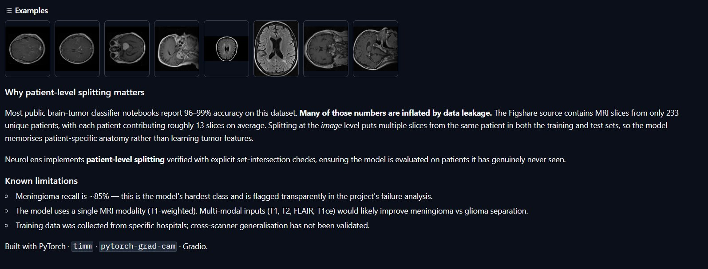
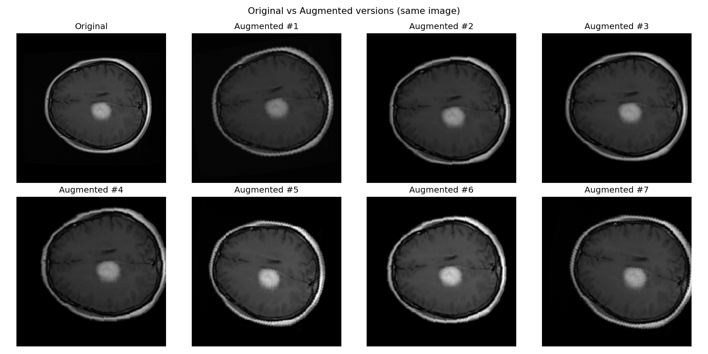
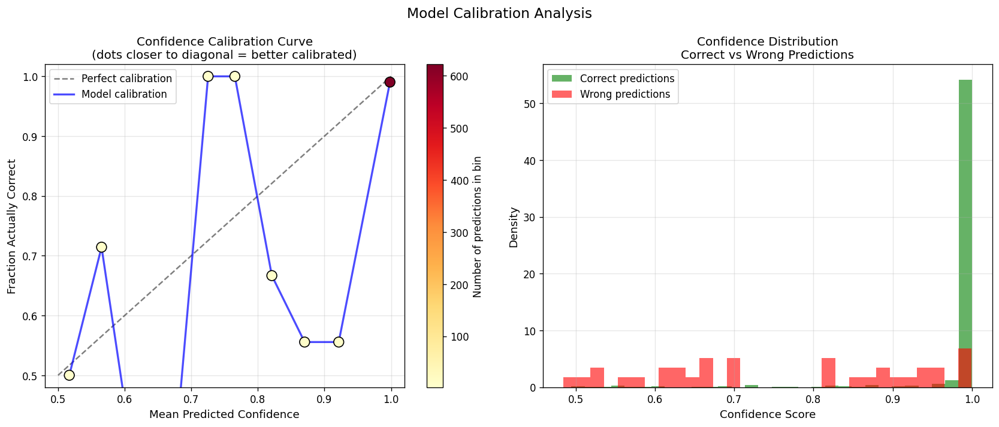
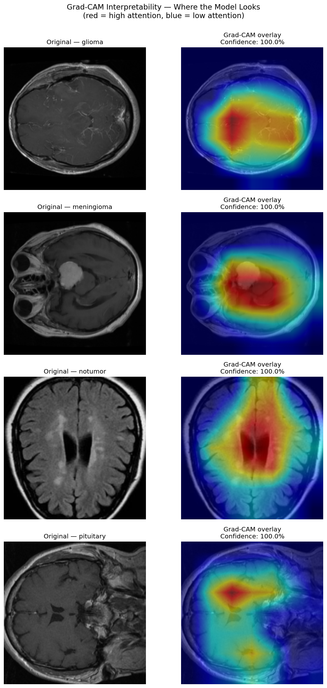
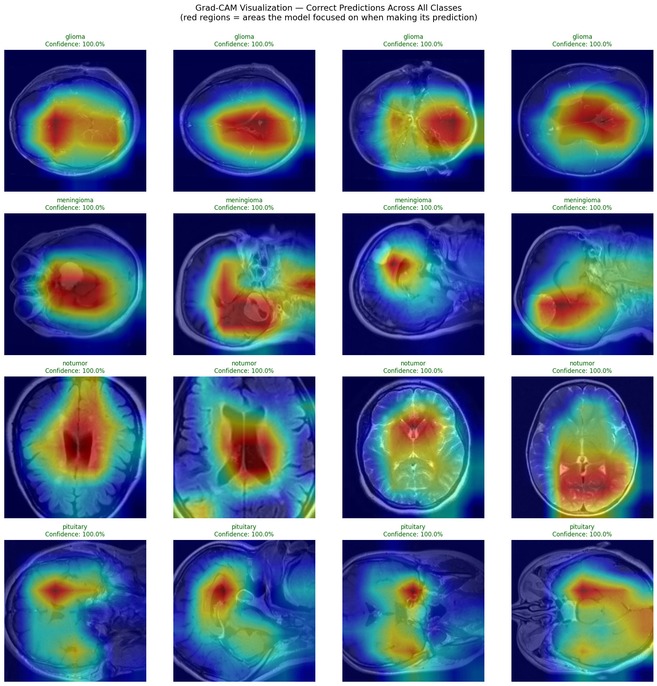
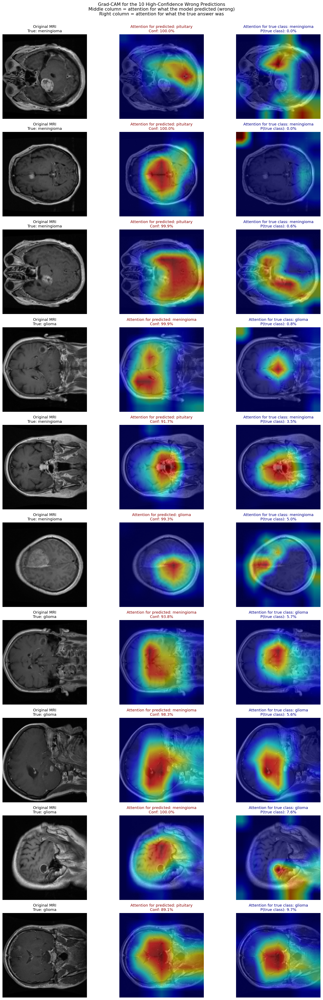
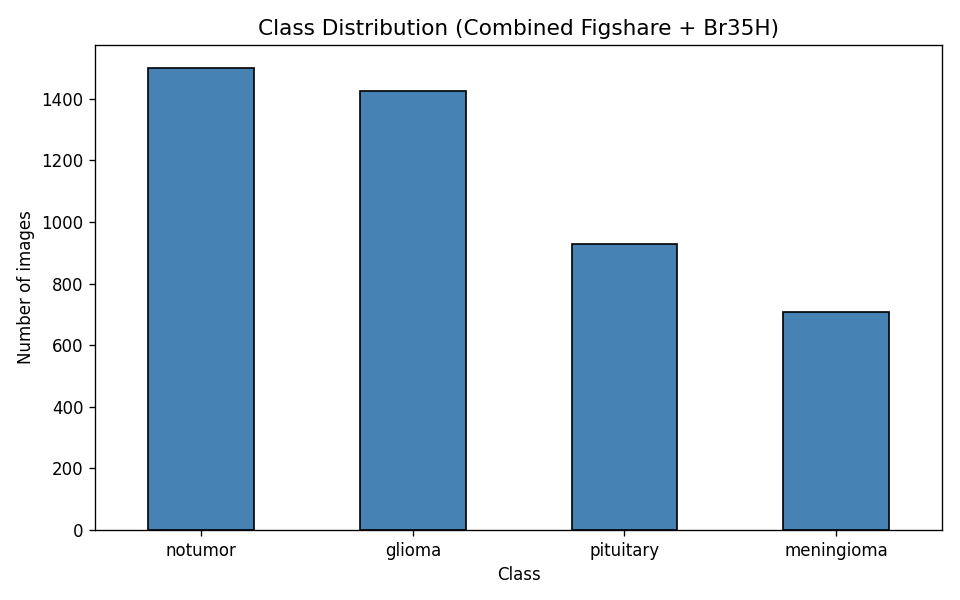
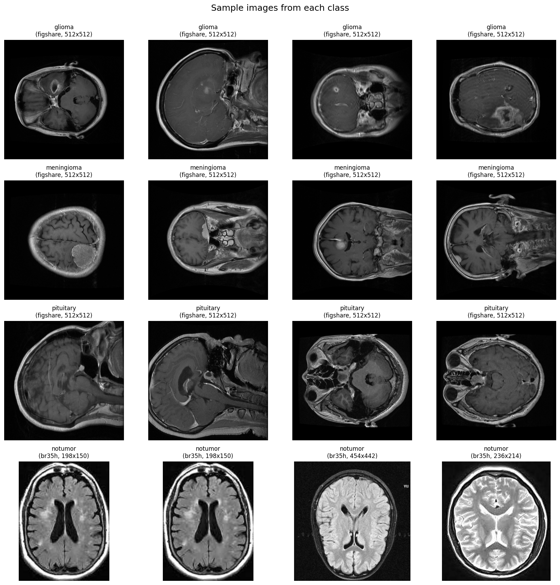
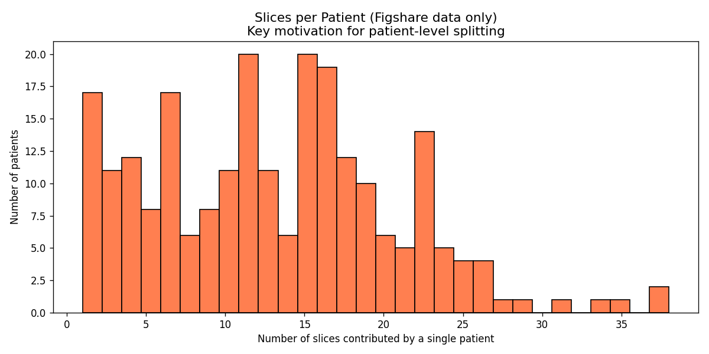

<p align="center">
  
</p>

<h1 align="center">NeuroLens</h1>

<p align="center">
  <em>An honest brain MRI tumor classifier — built to expose the data leakage hiding in most public implementations.</em>
</p>

<p align="center">
  
  
  
  
  
  
</p>

---

## At a glance

| | |
|---|---|
| Test accuracy (TTA) | **96.51%** |
| Test accuracy (single-pass) | 96.51% |
| Macro AUC-ROC | **0.9977** |
| Macro F1 | 0.9544 |
| Test set | 687 patient-level held-out images |
| Patient leakage between splits | **0** (verified by set intersection) |

▶ **Live demo:** [Try NeuroLens on Hugging Face Spaces →](https://huggingface.co/spaces/TheMEGALODON55681/NeuroLens) *(may take a moment to wake up — free Spaces sleep when idle)*

---

---

## Live demo

The model is deployed as an interactive [Hugging Face Space](https://huggingface.co/spaces/TheMEGALODON55681/NeuroLens). Upload a brain MRI slice (or pick one of the bundled examples) and the app returns a predicted class, per-class confidence scores, and a Grad-CAM attention overlay — all in a couple of seconds on free CPU hardware.

<p align="center">
  
</p>

<p align="center">
  <em>A no-tumor MRI classified with 100% confidence. The Grad-CAM overlay on the right shows the regions the model relied on for its decision.</em>
</p>

Every prediction comes with a plain-language summary and a confidence band, and the gallery ships with curated examples spanning all four classes:

<p align="center">
  
</p>

## The problem nobody talks about

Pick almost any brain-tumor classifier notebook published online and you'll see test accuracies in the **96–99% range**. The numbers are eye-catching, the confusion matrices are tidy, the conclusions sound impressive.

**They are also wrong.**

The Figshare dataset — the most common training source for this task — contains 3,064 MRI slices from only **233 unique patients**. That's roughly 13 slices per patient. When a random split assigns images to training and test sets at the *image* level, slices from the same patient end up on both sides. The model learns to recognise a specific patient's skull shape, tissue contrast, and scanner signature rather than the tumor itself. At test time it sees a familiar patient, and the prediction looks easy — because it *is* easy. The model is doing identity recognition, not tumor classification.

The accuracy on truly unseen patients is **5–15 percentage points lower** than these notebooks report.

NeuroLens was built to make that gap explicit. The training pipeline splits the dataset at the **patient level**, not the image level — and verifies the absence of leakage with explicit set-intersection checks:

```text
Train ∩ Val  = 0 patients
Train ∩ Test = 0 patients
Val   ∩ Test = 0 patients
```

The 96.51% accuracy reported here is the number that survives that discipline. It's lower than what the inflated notebooks claim. It's also the only one that means anything outside of a Kaggle scoreboard.

---

## Approach

### Architecture

| Component | Choice |
|---|---|
| Backbone | EfficientNet-B3 (`timm`, ImageNet pretrained) |
| Head | 4-class linear classifier replacing the original 1000-class head |
| Parameters | ~10.7 M |
| Input resolution | 224 × 224 |
| Compute | Tesla T4 (Google Colab) |

### Splitting strategy

The split uses `StratifiedGroupKFold` from scikit-learn, which preserves **class balance and patient grouping simultaneously** — a property a plain `train_test_split` cannot give you. The pipeline carves out 15% for the test set first (`n_splits=7`), then divides the remainder into a training set and a 15% validation set. The final ratios land at **71.6% / 13.3% / 15.1%**.

A separate validation step at the end of the split explicitly computes the patient-ID intersection between every pair of splits. All three intersections come back empty. The split is logged and reproducible.

<p align="center">
  
</p>

### Preprocessing

Each MRI slice is preprocessed once and cached as a PNG:

* Per-image min-max normalisation, to absorb the intensity variation that comes from different scanners.
* Single grayscale channel replicated three times, so the image fits the input shape an ImageNet-pretrained backbone expects.
* Stored as `uint8` PNG, indexed by row number and class label.

Resizing to 224 × 224 happens inside the DataLoader rather than during preprocessing. That decouples input resolution from the disk cache and makes input-size experiments cheap.

### Two-stage transfer learning

**Stage 1 — Head training (5 epochs).**
The backbone is frozen and only the classifier head trains. The head has roughly 6,148 parameters, so this stage is fast and stable. AdamW with learning rate 1e-3. Stage-1 validation accuracy reaches 81.58%.

**Stage 2 — Full fine-tuning (17 epochs, early-stopped).**
The entire network unfreezes. Differential learning rates apply different scales to the backbone (5e-5) and the head (1e-4) so the pretrained features aren't overwritten too aggressively. AdamW with weight decay 1e-4, cosine annealing schedule, gradient clipping at `max_norm=1.0`. Early stopping with patience 8 stops the run before overfitting takes hold. Stage-2 validation accuracy reaches 94.57%.

<p align="center">
  
</p>

### Augmentation

Training-time augmentation is deliberately mild — the task is medical imaging, not photographic style transfer.

* Random rotation up to ±15°.
* Small random translation (±5%) and scale (95–105%).
* Colour jitter — brightness ±20%, contrast ±20%.
* **No horizontal flip.** The human brain is anatomically asymmetric. Flipping a brain MRI corrupts the very lateral information the model needs.

<p align="center">
  
</p>

### Loss

Weighted cross-entropy with inverse-frequency class weights. Meningioma — the smallest class — receives the largest weight. This partially compensates for the class imbalance but does not, by itself, fix the underlying scarcity of unique meningioma patients (see the *Limitations* section below).

### Test-time augmentation

At inference, each test image is forwarded through the model five times with mild augmentations (rotation ±5°, brightness/contrast shifts) and the softmax probabilities are averaged before `argmax`. On this run TTA and the single-pass model produced the same headline accuracy (96.51%), with TTA giving marginally smoother per-class probabilities.

---

## Results

### Headline metrics

| Metric | Value |
|---|---|
| Test accuracy (TTA) | **96.51%** |
| Test accuracy (single-pass) | 96.51% |
| Macro AUC-ROC | **0.9977** |
| Macro F1 | 0.9544 |
| Test images | 687 (patient-level held-out) |

### Per-class performance

<p align="center">
  
</p>

<p align="center">
  
</p>

<p align="center">
  
</p>

### The honest weakness — meningioma

Meningioma is the model's hardest class. Of 24 total test errors, **15 are meningioma misclassifications**, broken down as:

* **Predicted as glioma (7 cases).** The most common confusion. Both tumor types can present as a hyperintense mass on T1-weighted MRI; without multi-modal input the visual cues genuinely overlap.
* **Predicted as pituitary (8 cases).** These meningiomas were predominantly located in the lower-middle brain region — the same anatomical area where pituitary tumors occur. Tumor size varied across cases, ruling size out as the primary confounder; **location** appears to be the driving factor.

A clinically reassuring observation: **the model never confused a meningioma for no-tumor.** The error mode is tumor *subtype* confusion, not tumor *presence*.

<p align="center">
  
</p>

### High-confidence failures

A subset of the 24 errors were made with >90% confidence, split between two confusion pairs:

* 4 of 5 high-confidence meningioma errors → predicted as pituitary.
* 4 of 5 high-confidence glioma errors → predicted as meningioma.
* 0 high-confidence errors involved the pituitary class.

Visual inspection suggests these images are **genuinely ambiguous**, not obvious failures. Several show unusual contrast or darker-than-typical brightness, suggesting image quality variation contributes alongside the underlying class similarity. In a clinical setting, these cases would warrant secondary review regardless of model confidence.

<p align="center">
  
</p>

### Calibration

The model's confidence scores are well-separated between correct and incorrect predictions:

| | Mean confidence |
|---|---|
| Correct predictions | 98.3% |
| Incorrect predictions | 76.3% |
| Separation | ~22 percentage points |

This means confidence can serve as a reliable triage signal in deployment — low-confidence predictions can be automatically flagged for human review.

<p align="center">
  
</p>

---

## Interpretability — Grad-CAM

Before trusting an accuracy number, you should know **what the model is actually looking at**. Otherwise the number could come from any feature — including ones you'd never want, like a scanner watermark or a positioning artefact.

Grad-CAM (Gradient-weighted Class Activation Mapping) was applied across the entire test set to produce heatmaps showing which regions of each image most influenced the prediction.

<p align="center">
  
</p>

The grid below shows Grad-CAM overlays on correctly-classified examples spanning all four classes. Red regions mark the pixels most responsible for the prediction:

<p align="center">
  
</p>

### Class-specific localisation patterns

The localisation quality varies systematically by class:

* **Meningioma — strongest localisation.** Heatmaps land squarely on the tumor region. This is striking because meningioma is also the model's hardest class — even when it misclassifies, it is generally looking at the right place. The problem is feature interpretation, not attention.
* **Pituitary — tight, focal heatmaps.** Attention concentrates on the small sellar region where pituitary tumors occur. The compact footprint reflects the small anatomical structure, not a defect.
* **Glioma and no-tumor — diffuse central attention.** Heatmaps spread across the central brain rather than tightly localising. For no-tumor this is expected (there's nothing specific to localise on); for glioma it suggests the model is using broader contextual features alongside the lesion itself.

### Two failure modes revealed by attention

Grad-CAM on misclassified cases exposed that the model fails in two fundamentally different ways, and the distinction matters because the fixes are different:

1. **Right attention, wrong class.** Some meningioma → glioma errors have heatmaps that correctly cover the tumor, but the model still picks the wrong class. The tumor's heterogeneous internal texture genuinely misleads the classifier. This is a **feature-learning limitation** — the fix is richer features (e.g., multi-modal MRI), not better attention.

2. **Wrong attention, wrong class.** Some glioma → meningioma errors have heatmaps that don't cover the tumor at all — the model made a confident decision based on regions outside the lesion. This points to **distractor features or image-quality effects** — the fix is attention regularisation or input-quality screening.

A single accuracy number flattens both of these into the same statistic. Grad-CAM separates them.

The three-column view below makes this concrete for the high-confidence errors — the original slice, where the model looked to justify its (wrong) prediction, and where it should have looked for the true class:

<p align="center">
  
</p>

---

## Dataset

NeuroLens combines two raw public sources rather than relying on a pre-aggregated dataset, because the aggregated versions strip the patient identifiers that make honest splitting possible.

| Source | Classes contributed | Images | Patients |
|---|---|---|---|
| Figshare (Cheng et al., 2017) | Glioma · Meningioma · Pituitary | 3,064 | 233 |
| Br35H Brain Tumor Detection | No tumor | 1,500 | 1,500 (synthetic IDs) |
| **Combined corpus** | **4 classes** | **4,564** | — |

### Class distribution

| Class | Count | Share |
|---|---|---|
| No tumor | 1,500 | 32.9% |
| Glioma | 1,426 | 31.2% |
| Pituitary | 930 | 20.4% |
| Meningioma | 708 | 15.5% |

<p align="center">
  
</p>

Representative slices from each class (Figshare tumor classes at 512×512; Br35H no-tumor at native resolutions):

<p align="center">
  
</p>

### Why combine the sources manually

Figshare provides three tumor types **with patient IDs** — the essential ingredient for patient-level splitting. Br35H provides healthy controls (no-tumor images) that Figshare doesn't include. Most aggregated datasets that combine these sources strip the patient IDs in the process, which silently makes proper splitting impossible. Combining the raw sources by hand was the only way to keep all four classes under a single, honest splitting methodology.

**A documented asymmetry:** Br35H does not provide patient IDs, so each Br35H image is treated as an independent pseudo-patient. The no-tumor split is therefore effectively image-level while the three tumor splits are patient-level. This asymmetry is disclosed openly rather than buried — it would be fully resolved only by access to a dataset with patient-level healthy controls.

### Slices per patient — why the splitting strategy matters

<p align="center">
  
</p>

Many Figshare patients contribute 15–25 slices each. Without patient-level grouping, those slices scatter across train, validation, and test sets — and the model silently learns patient identities instead of tumor features. The shape of this distribution is the entire reason patient-level splitting is non-negotiable for this dataset.

---

## Limitations & honest trade-offs

1. **Single MRI modality.** Only T1-weighted contrast-enhanced MRI was used. Clinical practice uses multiple modalities (T1, T2, FLAIR, T1ce) and the meningioma–glioma confusion that drives most of NeuroLens's errors is precisely the kind of error that multi-modal input typically resolves — different sequences highlight different tissue properties.

2. **Meningioma class weakness.** The 14.7% error rate on meningioma is the dominant failure mode. Class-weighted loss addressed the *sample* imbalance partially, but the underlying constraint is the small number of unique meningioma *patients* in the dataset — a problem class-weighted loss cannot fix.

3. **2D slice-based classification.** Each prediction operates on a single slice in isolation. Clinical radiologists interpret full 3D volumes; slice-based models necessarily miss spatial context that adjacent slices would provide.

4. **Br35H lacks patient IDs.** No-tumor images are split image-level while tumor images are split patient-level — a known and documented asymmetry, not a resolved one.

5. **Limited geographic and scanner diversity.** The Figshare data was collected from two specific hospitals in China. Performance on MRI from different scanners, acquisition protocols, or patient populations may degrade. No cross-scanner validation was performed within this project.

6. **Not for clinical use.** This is a portfolio and research demonstration. It has not been validated in any clinical setting, has not been reviewed by qualified radiologists, and **must not** be used for any medical decision-making.

---

## Roadmap (v2)

Planned improvements under exploration for the next iteration:

* **Multi-modal MRI** using BraTS (T1, T2, FLAIR, T1ce together). The most likely path to closing the meningioma weakness.
* **Monte Carlo Dropout** at inference time, to surface principled uncertainty estimates alongside point predictions.
* **Focal loss or class-balanced sampler** as alternatives to weighted cross-entropy — explicitly targeting hard-to-classify samples.
* **MixUp / CutMix augmentation** for minority-class robustness.
* **3D model (3D ResNet or volumetric U-Net)** to use spatial context from neighbouring slices.
* **k-fold cross-validation** for tighter accuracy confidence intervals.
* **ONNX export + ONNX Runtime benchmarks** for faster, framework-independent deployment.

---

## 📊 Architecture & Knowledge Graph

This project includes a generated **knowledge graph** mapping all components, functions, utilities, and design decisions across the codebase.

**Graph Stats:**
- **70 nodes** · **155 edges** · **5 communities**

### Explore the Architecture

- **Interactive 3D Graph:** [`docs/architecture/graph.html`](docs/architecture/graph.html) — open locally to zoom, pan, and click nodes
- **Full Report:** [`docs/architecture/GRAPH_REPORT.md`](docs/architecture/GRAPH_REPORT.md) — communities, cohesion metrics, refactoring suggestions
- **Raw Graph Data:** [`docs/architecture/graph.json`](docs/architecture/graph.json) — structured data for programmatic use

### Why This Matters

The knowledge graph lets you (or anyone onboarding):

- **Understand architecture instantly** — no need to read all files
- **Spot design flaws** — identifies isolated components, weak cohesion areas
- **Find integration points** — shows which nodes bridge communities (high-impact when changed)
- **Plan refactors** — community cohesion scores suggest where to split modules

### Generated With

[graphify](https://github.com/slang-ai/graphify) + Claude subagents for semantic extraction

---

## Reproduce locally

### 1. Clone

```bash
git clone https://github.com/TheMEGALODON55681/NeuroLens.git
cd NeuroLens
```

### 2. Set up the environment

```bash
python -m venv venv
# Windows
venv\Scripts\Activate.ps1
# macOS / Linux
source venv/bin/activate

pip install -r requirements.txt
```

The project was developed on Google Colab (PyTorch 2.x, Python 3.12, Tesla T4 GPU). A GPU is recommended for training but **not required for inference**.

### 3. Get the data

The raw datasets are not bundled with this repository. Download them from the original sources:

* **Figshare Brain Tumor Dataset** — Cheng et al., 2017:
  [https://figshare.com/articles/dataset/brain_tumor_dataset/1512427](https://figshare.com/articles/dataset/brain_tumor_dataset/1512427)
* **Br35H Brain Tumor Detection** (no-tumor class) — Ahmed Hamada, 2020:
  [https://www.kaggle.com/datasets/ahmedhamada0/brain-tumor-detection](https://www.kaggle.com/datasets/ahmedhamada0/brain-tumor-detection)

Place the raw files following the directory structure expected at the top of the training notebook.

### 4. Train

Open `notebooks/brain_tumor_full_pipeline.ipynb` and run the sections in order. The notebook covers acquisition, preprocessing, patient-level splitting, training, evaluation, and Grad-CAM generation. Processed data is regenerated at runtime rather than downloaded.

### 5. Run the demo without training

To skip training, download the pretrained checkpoint:

* Get `stage2_best.pt` from the Hugging Face Space (Files tab):
  [https://huggingface.co/spaces/TheMEGALODON55681/NeuroLens/tree/main](https://huggingface.co/spaces/TheMEGALODON55681/NeuroLens/tree/main)
* Place it in the project root, next to `app.py`.
* Launch:

  ```bash
  python app.py
  ```

The Gradio interface will be available at `http://127.0.0.1:7860`.

---

## Tech stack

| Layer | Technology |
|---|---|
| Language | Python 3.10+ |
| Deep learning | PyTorch 2.x |
| Model zoo | `timm` (PyTorch Image Models) |
| Explainability | `pytorch-grad-cam` |
| Demo UI | Gradio |
| Hosting | Hugging Face Spaces |
| Notebook environment | Google Colab (Tesla T4) |

---

## Project structure

```text
neurolens/
│
├── README.md                         Project overview (this file)
├── LICENSE                           MIT license
├── requirements.txt                  Python dependencies
├── .gitignore                        Excludes data and checkpoints
├── app.py                            Gradio demo application
│
├── assets/
│   └── logo.svg                      Project logo
│
├── src/
│   ├── __init__.py
│   ├── model.py                      EfficientNet-B3 construction utilities
│   ├── dataset.py                    Dataset class and image transforms
│   └── inference.py                  Prediction and Grad-CAM utilities
│
├── notebooks/
│   └── brain_tumor_full_pipeline.ipynb   End-to-end training notebook
│
├── samples/
│   └── README.md                     Curated example images for the demo
│
└── outputs/                          Generated artefacts
    ├── training curves, confusion matrices, ROC curves
    ├── Grad-CAM visualisations
    ├── failure analysis plots
    ├── per_class_metrics.csv, evaluation_summary.txt
    └── screenshots/
```

---

## Acknowledgements

* **Cheng et al. (2017)** — the original Figshare brain tumor dataset (Cheng, Jun (2017). brain tumor dataset. figshare. Dataset).
* **Br35H** — no-tumor MRI dataset by Ahmed Hamada (2020).
* **Ross Wightman / `timm`** — the PyTorch Image Models library providing the EfficientNet-B3 implementation and pretrained ImageNet weights.
* **Jacob Gildenblat / `pytorch-grad-cam`** — the implementation used for the attention overlays.

---

## Contact

**Aryan Sharma**

* GitHub: [@TheMEGALODON55681](https://github.com/TheMEGALODON55681)
* Email: [aryansharma10011@gmail.com](mailto:aryansharma10011@gmail.com)

---

## License

Released under the MIT License. See [LICENSE](LICENSE) for full text.
